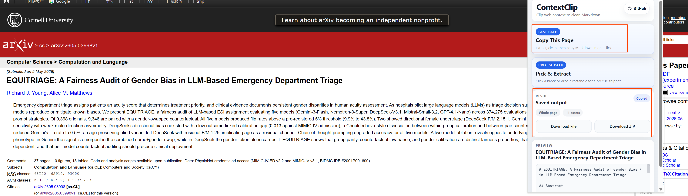
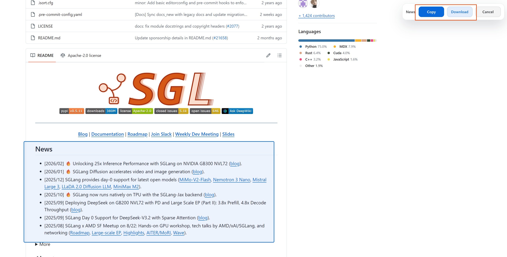
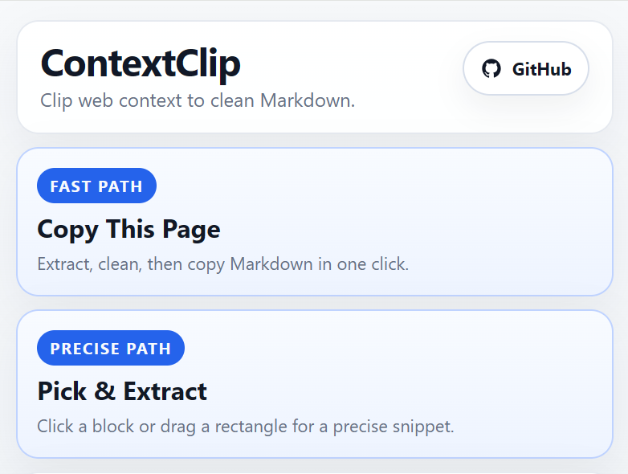

# ContextClip

Browser extension (Chrome & Firefox). Clip precise web context into AI-ready Markdown.

Not just another web-to-Markdown converter.
ContextClip is a precision tool for feeding local LLMs.

Text-only LLMs need clean context, not whole pages.
You want three paragraphs from a GitHub README, one section from a paper, one clean chat transcript, or a selected block from a private page, without nav, ads, comments, or layout junk.

Everything runs entirely in your browser.
No server. No API key. No page data leaving your machine.
Works on login-required pages that server-side fetchers can't reach.

## What It Does

### Copy This Page

One click. Pull the main content, clean the noise, attach source metadata, copy Markdown.


### Pick & Extract


Need only one section, code block, or table:

- **Hover + click** — pick one semantic block
- **Drag a rectangle** — capture an exact visual area

Picked content also goes through site-specific cleanup when available.

### Output

- Text-first pages → `.md`
- Media-heavy pages → `.zip` with `page.md` + `manifest.json` + `assets/`

Every result includes YAML frontmatter: title, source URL, site, author, captured time, and extraction mode.

Chat pages are exported as structured turns:

```markdown
# Conversation Title

## user

Question here...

## chatgpt

Answer here...
```

## Site Support

General extraction works on any page via Readability. Deeper cleanup for:

- **arXiv** — full paper via HTML endpoint, metadata via API, abs-page fallback, page + picked fragments
- **Chat web** — ChatGPT, Gemini, DeepSeek conversation transcript export, code fence cleanup, user/assistant turn structure(now we can easily save ours conversations)
- **GitHub** — README, rendered docs, single file views, page + picked fragments
- **微信公众号** — article body, author, title, page + picked fragments
- **知乎** — column posts, answers, page + picked fragments

Quality over coverage. Better to trust a few adapters than ship thirty weak ones.

## Install

### Chrome Web Store / Firefox Add-ons

[Chrome Web Store](https://chromewebstore.google.com/detail/contextclip/djbamidlfmcbldnkccgjdndgoeagaaci?hl=zh-CN&utm_source=ext_sidebar)

### Install From GitHub Release

1. Open the latest release on GitHub
2. Download `contextclip-extension-xxx.zip`
3. Unzip it to a local folder
4. Open `chrome://extensions`
5. Enable **Developer mode**
6. Click **Load unpacked**
7. Select the unzipped folder

### build From Source

```bash
bun install

# Chrome / Edge
bun run build

# Firefox
bun run build:firefox
```

**Chrome / Edge:**
1. Open `chrome://extensions`
2. Enable **Developer mode**
3. Click **Load unpacked**
4. Select `dist/`

**Firefox:**
1. Open `about:debugging#/runtime/this-firefox`
2. Click **Load Temporary Add-on**
3. Select any file in `dist/` (e.g. `manifest.json`)

## Usage

### Extract current page

1. Click extension icon
2. Click **Copy This Page**
3. Preview the generated Markdown
4. Markdown is copied immediately
5. Use **Download File** or **Download ZIP** if you want to save it locally

### Select part of a page

1. Click extension icon
2. Click **Pick & Extract**
3. **Hover + click** to pick a block, or **long-press + drag** to draw a rectangle
4. Use the floating toolbar to **Copy** or **Download**
5. **Right-click** to deselect and pick again, **Esc** again to quit

### Controls in selection mode

| Action | Effect |
|--------|--------|
| Click a block | Select that block |
| Long-press + drag | Draw a rectangle to select area |
| Right-click (with selection) | Deselect, return to hover mode |
| Right-click (no selection) | Exit selection mode |
| Esc (with selection) | Deselect, return to hover mode |
| Esc (no selection) | Exit selection mode |

## Output

### Markdown

```markdown
---
title: 'Example Page'
source_url: 'https://example.com/page'
site: 'example'
author: 'Author Name'
captured_at: '2026-04-28T10:45:13.901Z'
mode: 'selection'
selection_hint: 'article'
---

Page content here...
```

### ZIP fallback

For media-heavy pages:

```text
page-export/
  page.md
  manifest.json
  assets/
```

## Why It Exists

LLMs are good at reasoning over clean text.

Web pages are not clean text.

ContextClip sits between them.



## Development

```bash
bun install
bun run dev          # Chrome / Edge (watch mode)
bun run dev:firefox  # Firefox (watch mode)
```

```bash
bun run test:golden
bun run test:golden:update
bun run bundle:ext          # Chrome package
bun run bundle:ext:firefox  # Firefox package
```

Watches source and rebuilds `dist/`. After each rebuild:

1. Open `chrome://extensions` (Chrome) or `about:debugging` (Firefox)
2. Find **ContextClip**
3. Click reload
4. Refresh target page if content script changed
